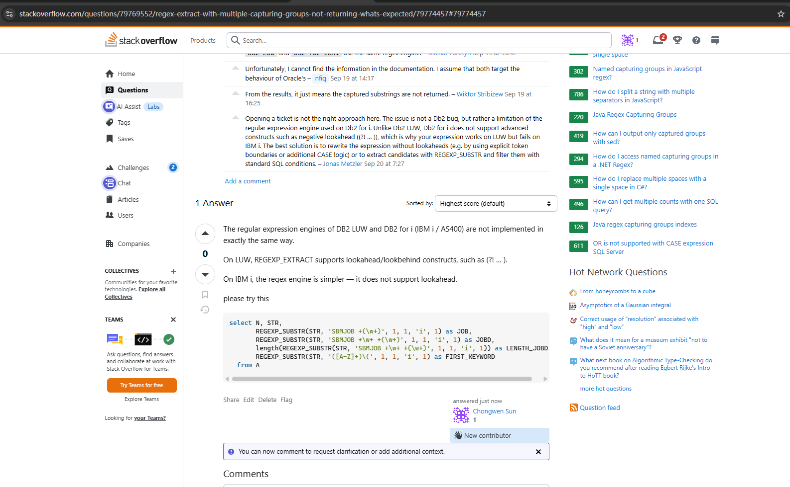

```python
student name: chongwen sun
student number；106414816
assignment: 530-lab4
```

Question #1 - Python Imports


```python

import random
# Imports the random module


import random as rnd
# Imports the random module and names it rnd


from random import random
# Imports the random() function from the random module


from random import random as rnd
# Imports the random() function from the random module and names it rnd


import numpy.random
# Imports the random submodule of the numpy package


import numpy
# Imports the numpy package


# import X.Y.Z as T
# Imports the Z submodule of the package X.Y and names it as T


from Bio.Blast import NCBIWWW
# Imports the NCBIWWW module from the Bio.Blast package

```

Question #2 - Python Library 


```python
import json
with open("provdata.json", "r") as f:
    data = json.load(f)
items = []
for list_element in data["data"]:
    province_name = None
    population = None

    for key,value in list_element.items():
        if len(key) > 2:
            province_name = key
        else:
            population = float(value)
    items.append((province_name, population))

largest = max(items, key=lambda x: x[1])

print("Province with the largest population: ", largest[0],", Population (millions): ", largest[1])
```

    Province with the largest population:  Ontario , Population (millions):  13.6
    

Question #3 - R Library 


```python
library(jsonlite)

data <- fromJSON("provdata.json", simplifyVector = FALSE)

items <- lapply(data$data, function(obj) {
  province <- names(obj)[nchar(names(obj)) > 2]
  abbrev <- obj[[province]]
  population <- as.numeric(obj[[abbrev]])
  
  data.frame(
    province   = province,
    abbrev     = abbrev,
    population = population,
    stringsAsFactors = FALSE
  )
})

df <- do.call(rbind, items)
idx <- which.max(df$population)
cat("Province with the largest population:", df$province[idx],", Population (millions):", df$population[idx], "\n")
```

    Province with the largest population: Ontario , Population (millions): 13.6 
    

Question #4 - Debugging


# Prints the numbers from 1 to 10
for i in range(1,10)
  print(i)


```python
#correct
for i in range(1,10):
  print(i)
```

    1
    2
    3
    4
    5
    6
    7
    8
    9
    

# Allows user to enter a number until enters STOP. Multiplies number by 2. Handles incorrect user input.
num = int(input("Enter a number:"))
while num != "STOP":  
  print(num*2)  
  num = int(input("Enter a number:"))


```python
while True:
    user_input = input("Enter a number:")
    if user_input == "STOP":
        break
    try:
        num = int(user_input)
        print(num * 2)
    except ValueError:
        print("Invalid input. Please enter a number or STOP.")

```

    Enter a number: 1
    

    2
    

    Enter a number: 2
    

    4
    

    Enter a number: STOP
    

# Prints out items in a list in between 4 and 8 inclusive
data = [6, 5, 3, 4, 7, 1, 8]
for i in range(0,len(data)+1):
  if data[i] >= 4 && data[i] < 8:
    print("Data: ")
  print(data[i])


```python
# Prints out items in a list in between 4 and 8 inclusive
data = [6, 5, 3, 4, 7, 1, 8]
for i in range(0,len(data)):
  if data[i] >= 4 & data[i] < 8:
    print("Data: ")
  print(data[i])

```

    Data: 
    6
    Data: 
    5
    Data: 
    3
    Data: 
    4
    Data: 
    7
    Data: 
    1
    Data: 
    8
    

Question #5 - Getting Help in Python


```python
# Create a Python set with 5 numbers and print it
nums = {1, 2, 3, 4, 5}
print(nums)
# link is https://docs.python.org/3/library/stdtypes.html#set
```

    {1, 2, 3, 4, 5}
    


Question #6 - Getting Help in R


```python
help(data.frame)
```


```python
screenshot
```


Question #7 - Help Online





```python

```
